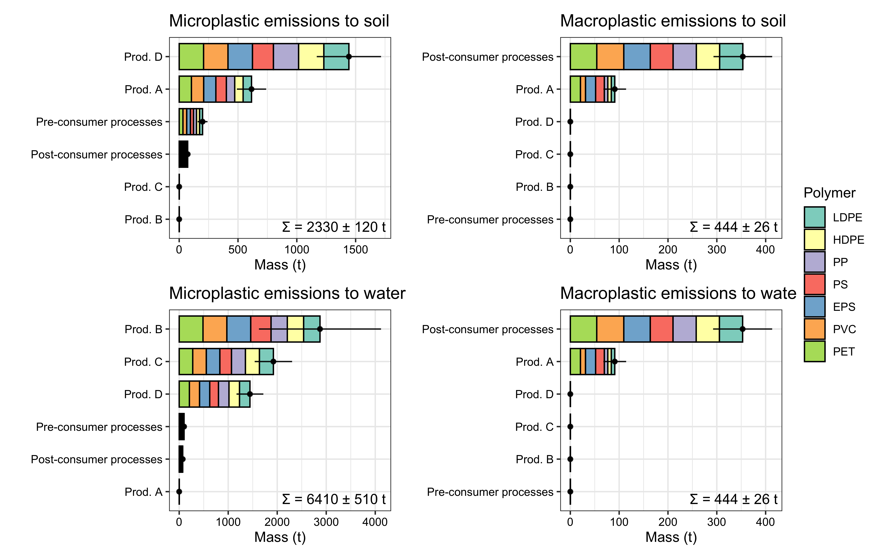

# PMFA Plastic Release Model Framework

## Overview

This repository provides the R code and an example input file for a probabilistic material flow analysis (PMFA) model of plastic flows and environmental releases. The framework follows plastic flows through the anthroposphere from a whole-life-cycle perspective and quantifies polymer-specific macroplastic and microplastic releases to soil and water.

The PMFA requires two main categories of input data:

1. material inputs entering the modeled system; and
2. transfer coefficients (TCs) describing the fraction of mass transferred from one model compartment to the next.

Probability distributions can be assigned to material inputs and transfer coefficients to represent their uncertainty. During the Monte Carlo simulation, each parameter is sampled from its assigned distribution and the resulting system of mass flows is solved repeatedly.

The framework includes seven commodity polymers:

- low-density polyethylene (LDPE);
- high-density polyethylene (HDPE);
- polypropylene (PP);
- polystyrene (PS);
- expanded polystyrene (EPS);
- polyvinyl chloride (PVC); and
- polyethylene terephthalate (PET).

## Scope of this repository

The code is derived from the modeling approach used by Jiang and Nowack (2025). This repository contains a simplified model and a synthetic input dataset intended to demonstrate the required data structure, probabilistic parameterization, and calculation workflow.

All numerical values in `Input/Sample_FeedData.xlsx` are synthetic. They must not be interpreted as empirical estimates for Switzerland or any other geographical region.

## Repository structure

```text
.
├── Code/
│   ├── 0-MasterScript.R
│   ├── 1-InputFormatting.R
│   ├── 2-Merging.R
│   ├── 3-CalculationScript.R
│   ├── Graph-EmissionsByProd.R
│   └── functions.needed*.R
├── Input/
│   ├── Sample_FeedData.xlsx
│   ├── InputFormatted.Rdata
│   └── InputReady.Mod2.Rdata
├── Results/
│   ├── ResultsMass_NoSimplification/
│   ├── EmissionsByProd.xlsx
│   └── EmissionsByProd.png
├── LICENSE
└── README.md
```

## Model workflow

The model is run through `Code/0-MasterScript.R`, which executes the following steps:

1. `1-InputFormatting.R` imports the material inputs and transfer coefficients, assigns their probability distributions, and normalizes outgoing flows.
2. `2-Merging.R` combines transfer coefficients within the anthroposphere with those for release flows and prepares the complete transfer coefficient matrix.
3. `3-CalculationScript.R` constructs and solves the material flow system for each polymer using Monte Carlo simulation.
4. `Graph-EmissionsByProd.R` aggregates the simulated releases by product category, polymer, and receiving environmental compartment, then exports a figure and an Excel table.

The default configuration uses 10,000 Monte Carlo iterations:

```r
SIM <- 10^4
```

Results are therefore distributions that capture the uncertainty propagated from the model inputs.

## Requirements

The model requires R and the following R packages:

```r
install.packages(c(
  "openxlsx",
  "trapezoid",
  "xlsx",
  "dplyr",
  "ggplot2",
  "patchwork",
  "sm",
  "mc2d"
))
```

The `xlsx` package requires a working Java installation.

## Quick start

Clone the repository and run the master script from the repository root:

```bash
git clone https://github.com/Danyang-J/PMFA-Plastic-release-model.git
cd PMFA-Plastic-release-model
Rscript Code/0-MasterScript.R
```

The relative file paths used by the scripts assume that the current working directory is the repository root. Runtime depends on the computer and the number of Monte Carlo iterations.

To use another workbook, place it in `Input/` and change the following setting in `Code/0-MasterScript.R`:

```r
excel.file <- "Sample_FeedData.xlsx"
```

## Input data

`Input/Sample_FeedData.xlsx` illustrates the expected workbook structure.

| Worksheet | Content |
| --- | --- |
| `Sheet1` | Workbook description and a summary of the other worksheets |
| `Input` | Polymer-specific material inputs entering the modeled system |
| `Module1` | Transfer coefficients describing flows within the anthroposphere |
| `Module2` | Transfer coefficients describing environmental release flows |
| `Rank` | Mapping from model compartment names to labels used in figures |

The input mass and transfer coefficients must use consistent mass units and compartment names. For each source compartment, outgoing transfer coefficients describe the fractions transferred to destination compartments. The script combines the transfer coefficients in `Module1` and `Module2` while ensuring that all transfer coefficients from each compartment sum to one.

The sample workbook should be used as the template when adapting the framework to another system or geographical region. Region-specific applications require appropriate product sectors, material flows, environmental release pathways, and probability distributions.

## Outputs

Running the complete workflow produces or updates the following files:

| Output | Description |
| --- | --- |
| `Input/InputFormatted.Rdata` | Imported and normalized inputs before the two transfer-coefficient modules are merged |
| `Input/InputReady.Mod2.Rdata` | Final model inputs and merged transfer-coefficient network |
| `Results/ResultsMass_NoSimplification/OutputMass_<polymer>.Rdata` | Simulated compartment masses for each polymer |
| `Results/EmissionsByProd.xlsx` | Mean and standard deviation of releases by polymer, product category, and environmental compartment |
| `Results/EmissionsByProd.png` | Summary figure of macroplastic and microplastic releases to soil and water |

The supplied plotting script reports mass in tonnes. Input data should be scaled consistently with this output convention.



## Citation

If you use or adapt this model, please cite:

> Jiang, D., & Nowack, B. (2025). Reconciling plastic release: Comprehensive modeling of macro- and microplastic flows to the environment. *Environmental Pollution, 383*, 126800.
> <https://doi.org/10.1016/j.envpol.2025.126800>

```bibtex
@article{jiang2025reconciling,
  title   = {Reconciling plastic release: Comprehensive modeling of macro- and microplastic flows to the environment},
  author  = {Jiang, Danyang and Nowack, Bernd},
  journal = {Environmental Pollution},
  volume  = {383},
  pages   = {126800},
  year    = {2025},
  doi     = {10.1016/j.envpol.2025.126800}
}
```

## License

This repository is licensed under the [Apache License 2.0](https://www.apache.org/licenses/LICENSE-2.0). See `LICENSE` for the full license text.
